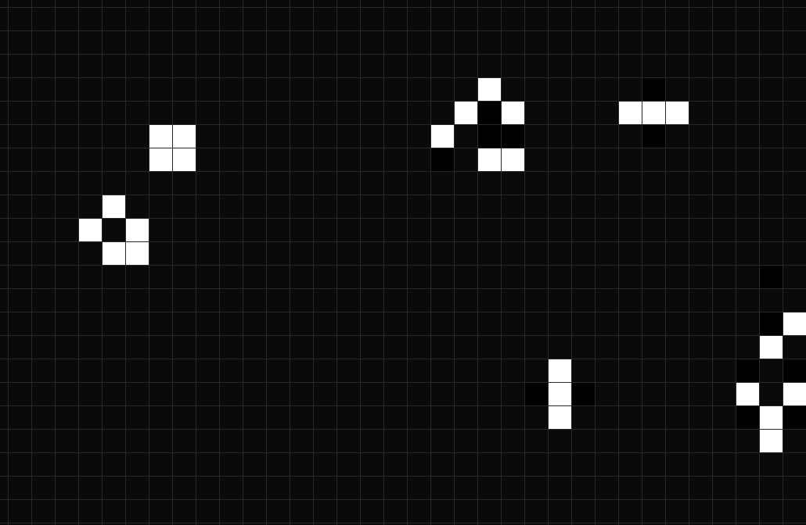

<a name="readme-top"></a>

<!-- PROJECT LOGO -->
<br />
<div align="center">
    <a href="https://github.com/wusi23/Game_of_live">
    
    <h1 align="center">Game of live</h1>
</div>
<br />
<br />

<!-- ABOUT THE PROJECT -->

## About The Project

Here is my interpretation of the Game of live.

<p align="right">(<a href="#readme-top">back to top</a>)</p>

<!-- GETTING STARTED -->

## Getting Started

### Installation

1. Clone the repo
   ```sh
   git clone https://github.com/wusi23/Game_of_live.git
   ```
2. Pip install pygame and numpy packages
   ```sh
   pip install pygame
   pip install numpy
   ```
3. Start main.py
   ```sh
   python main.py
   ```

<p align="right">(<a href="#readme-top">back to top</a>)</p>

<!-- CONTROLS -->

## Controls

### Mouse

Press Mousebutton to place seed on the field.

### Keybindings

- `Spacebar` Start and Stop
- `  +   ` accelerate generations
- `  -   ` decelerate generations
- `  0   ` setting speed to default

<!-- LICENSE -->

## License

Distributed under the MIT License. See `LICENSE.txt` for more information.

<p align="right">(<a href="#readme-top">back to top</a>)</p>

<!-- CONTACT -->

## Contact

Your Name - github@wusi.at

Project Link: [https://github.com/wusi23/Game_of_live](https://github.com/wusi23/Game_of_live)

<p align="right">(<a href="#readme-top">back to top</a>)</p>
